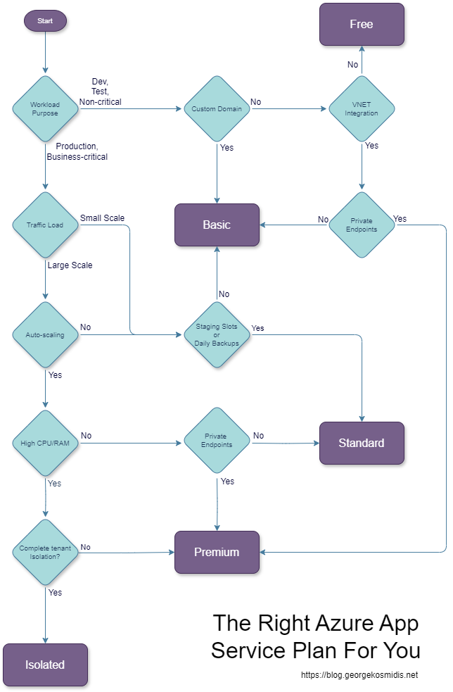

# The Right Azure Service Plan

Selecting the right Azure Service Plan is crucial for optimizing performance, cost, and scalability. Whether you're a startup experimenting with cloud services or an enterprise seeking robust solutions, Azure offers a variety of service plans to meet your needs. This guide will help you navigate through the Free, Basic, Standard, Premium, and Isolated tiers, ensuring you make an informed decision.

# The Service Plan Flowchart

Follow the arrows on the flowchart below to find your appropriate tier, and then [dive into your tier details](#dive-into-your-tier-details) to select your plan!

# Dive into your tier details!

Azure App Service Plans determine the resources and features available for your applications. Each tier offers different levels of CPU, RAM, storage, and additional features. Here's a breakdown of what each tier offers:

## 1. Free Tier

The Free Tier is perfect for small applications and experimentation. It provides:

| Plan | CPU                              | RAM  | Storage |
|------|----------------------------------|------|-------- |
| Free | Shared (60 CPU minutes per day)  | 1 GB | 1 GB    |

This tier is ideal for developers who want to test applications without incurring costs. However, it comes with limitations in terms of performance and features.

## 2. Basic Tier

The Basic Tier offers more resources and is suitable for small production workloads:

| Plan | CPU     | RAM    | Storage        |
|------|---------|--------|----------------|
| B1   | 1 Core  | 1.75 GB| 10 GB Storage  |
| B2   | 2 Cores | 3.5 GB | 10 GB Storage  | 
| B3   | 4 Cores | 7 GB   | 10 GB Storage  |

This tier is designed for applications that require more consistent performance than the Free Tier but do not need advanced features.

## 3. Standard Tier

The Standard Tier is a great choice for production workloads that require load balancing and auto-scaling:

| Plan | CPU     | RAM    | Storage        | 
|------|---------|--------|----------------|
| S1   | 1 Core  | 1.75 GB| 50 GB Storage  | 
| S2   | 2 Cores | 3.5 GB | 50 GB Storage  |
| S3   | 4 Cores | 7 GB   | 50 GB Storage  | 

With support for custom domains, SSL, and daily backups, this tier is ideal for business applications that need reliability and scalability.

## 4. Premium Tier

The Premium Tier is tailored for high-traffic applications requiring enhanced performance and advanced features:

| Plan | CPU     | RAM    | Storage         | 
|------|---------|--------|-----------------|
| P1   | 1 Core  | 3.5 GB | 250 GB Storage  |
| P2   | 2 Cores | 7 GB   | 250 GB Storage  |
| P3   | 4 Cores | 14 GB  | 250 GB Storage  |

This tier offers increased scalability, memory, and storage, making it suitable for large-scale applications with high availability needs.

## 5. Isolated Tier

The Isolated Tier is designed for applications that need to run in a private, dedicated environment:

| Plan | CPU     | RAM    | Storage        |
|------|---------|--------|----------------|
| I1   | 2 Cores | 8 GB   | 1 TB Storage   | 
| I2   | 4 Cores | 16 GB  | 1 TB Storage   | 
| I3   | 8 Cores | 32 GB  | 1 TB Storage   |

This tier provides the highest level of isolation and security, ideal for mission-critical applications that require compliance and data sovereignty.

# Making the Decision

When choosing a plan, consider the following factors:

- **Budget:** Determine how much you are willing to spend. The Free Tier is cost-effective for testing, while the Isolated Tier offers premium features at a higher cost.
- **Performance Needs:** Evaluate the CPU and RAM requirements of your applications. Higher tiers offer more resources and better performance.
- **Scalability:** Consider whether your application needs to handle variable loads. The Standard and Premium tiers support auto-scaling.
- **Security and Compliance:** If your application requires strict data security and compliance, the Isolated Tier is the best choice.

